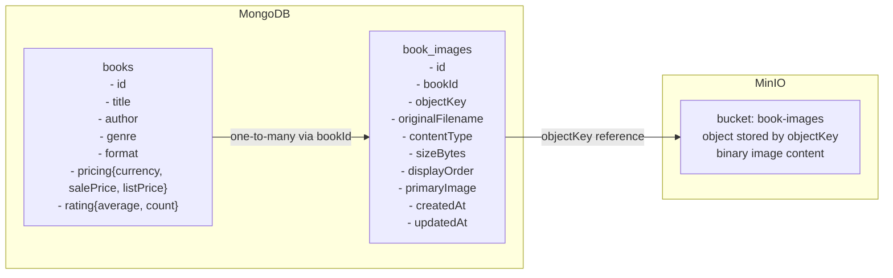

# Catalog Service - Books + Images

This service supports creating books together with one or more images. Image binaries are stored in MinIO and metadata is stored in MongoDB.

## API shape

### Create a book with images

`POST /catalog/books`

- `multipart/form-data`
- part `book`: JSON payload for the book fields
- part `images`: one or more image files

### Read books for the UI

`GET /catalog/books`

Each `BookDto` now includes an `images` array with:

- `id`
- `downloadUrl`
- `fileName`
- `contentType`
- `sizeBytes`
- `displayOrder`
- `primary`
- timestamps

### Manage book images

- `GET /catalog/books/{bookId}/images` — list image metadata
- `GET /catalog/books/{bookId}/images/{imageId}` — download a specific image
- `POST /catalog/books/{bookId}/images` — upload more images
- `DELETE /catalog/books/{bookId}/images/{imageId}` — delete one image

## Database Design

### Pictorial representation



### Storage notes

- MongoDB collection `books` stores the core catalog data.
- MongoDB collection `book_images` stores image metadata and the logical reference to the object in MinIO.
- MinIO stores the actual image binary using the `objectKey` referenced by `book_images`.
- The effective relationship is **one book -> many images**.
- `bookId + displayOrder` should remain unique per book so the UI gets a stable gallery order.

## Configuration

Set these environment variables (or place values in `application.yaml`):

- `MONGODB_URI` (default: `mongodb://localhost:27017/catalog_db`)
- `MINIO_ENDPOINT` (default: `http://localhost:9000`)
- `MINIO_ACCESS_KEY` (default: `minioadmin`)
- `MINIO_SECRET_KEY` (default: `minioadmin`)
- `MINIO_BUCKET` (default: `book-images`)
- `JWT_PUBLIC_KEY_LOCATION` (example: `file:/run/secrets/user-service-public.pem`)
- `JWT_JWK_SET_URI` (optional alternative to public key location)

JWT verification is local using RSA public key (or JWKS resolver), so requests are not validated by calling user-service every time.

## Quick Start (local)

Run MinIO:

```powershell
docker run --name minio -p 9000:9000 -p 9001:9001 `
  -e MINIO_ROOT_USER=minioadmin `
  -e MINIO_ROOT_PASSWORD=minioadmin `
  quay.io/minio/minio server /data --console-address ":9001"
```

Run service:

```powershell
.\gradlew.bat test
.\gradlew.bat bootRun
```

## Notes

- Image binaries are stored in MinIO.
- MongoDB collection `book_images` stores `bookId`, object key, original file name, content type, size, display order, and timestamps.
- Upload validation includes allowed content type and max file size.
- For efficient UI rendering, the API returns image metadata with the book list so the frontend can render thumbnails immediately without a second request per book.

